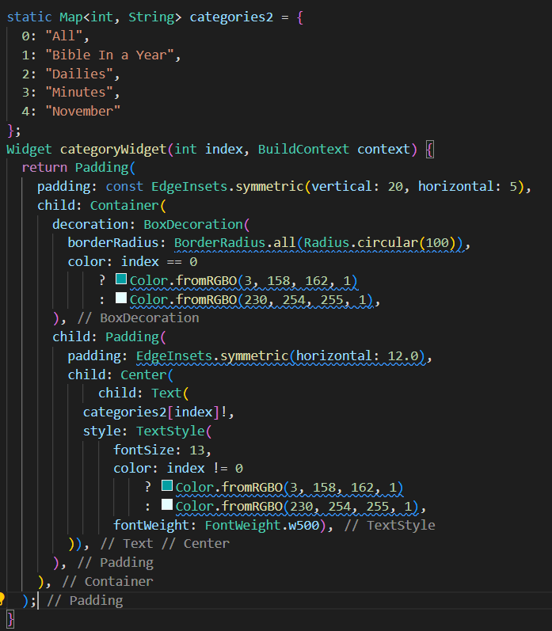

# Практическая работа №1
## Создание экранов при помощи Flutter
### Цель: разработка макетов на Flutter в соответсвие с заданным дизайном.
Ход работы:

Для использования шрифтов необходимо подключить библиотеку google_fonts.

В основе первого макета лежит виджет Column, а также Padding, который позволяет 
корректировать отступы между объектами.  
  
Для перехода между окнами выполнена настройка routes.  
  
При разработке второго и третьего макета для удобства написания идентичных виджетов шаблон выносится в отдельный метод.  
  
Для создания верхнего меню импользовался виджет AppBar.  
    
Для разработки кнопок третьего макета создан элемент Map,хранящий названия кнопок, а в методе данные названия подставляются.
  
  
Вывод: в ходе выполнения практической работы были разработаны макеты при помощи использования Flutter.
